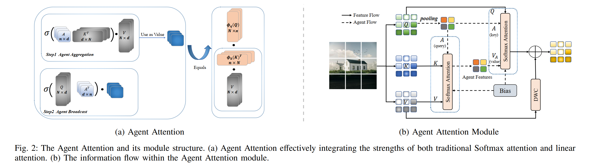

<div align="center">
<h1>AgentJSCC </h1>
<h3>AgentJSCC: Image Transmission based on Transformer Block with Agent Attention</h3>


​                                                                                                       **Xiaopeng Chu and Wenyi Zhang**  

​                                                                                 *Department of Electronic Engineering and Information Science*  

​                                                                                             *University of Science and Technology of China*             


## Overview Architecture


## Agent Attention




## Experimental results

We conducted comparative analyses among AgentJSCC, SwinJSCC, and DeepJSCC. The main schemes compared are as follows:

1. **DeepJSCC**: JSCC architecture based on CNN modules.
2. **SwinJSCC w/ SA**: JSCC architecture based on the Swin Transformer with Channel ModNet.
3. **AgentJSCC**: JSCC architecture based on the Vision Transformer incorporating the Agent Attention with Channel ModNet.


Fig. 3 presents a comparison of the visual reconstruction effects of three schemes under different channel conditions, with a fixed CBR of 1/24. The example image is selected from the Kodak test set and has an original resolution of 512×768. To better showcase detailed features, we cropped the center region of the image to 256×256 as the input for image reconstruction. As illustrated in Fig. 3, AgentJSCC more closely reproduces fine details such as the thin lines and textures within the window and suppresses artifacts, aligning more closely with the original
image. This demonstrates that our scheme achieves superior performance in terms of detail restoration and color fidelity, thereby delivering more impressive visual reconstruction.
More experimental results are shown in results.


## Installation

We implement AgentJSCC under python 3.10 ,PyTorch 2.3.1 and cuda11.8.

### For train

```
python train.py --training --trainset DIV2K --testset {kodak/CLIC21/afhq} --distortion-metric {MSE/MS-SSIM} --model {'Agent'/'Agent_W/O'} --channel-type {awgn/rayleigh} --C  --multiple-snr {random or fixed snr}
```

*e.g. testset=kodak , cbr = 0.0417, snr = [1, 4, 7, 10, 13], metric = PSNR, channel = AWGN

```s
python train.py --training --trainset DIV2K --testset kodak --distortion-metric MSE --model Agent --channel-type awgn --C 64  --multiple-snr 1,4,7,10,13
```

### For test

*e.g. testset=afhq , cbr = 0.0208, snr = [1, 4, 7, 10, 13], metric = PSNR, channel = Rayleigh

```
python train.py  --trainset DIV2K --testset kodak --distortion-metric MSE --model Agent --channel-type rayleigh --C 32  --multiple-snr 1,4,7,10,13
```


## Citation
